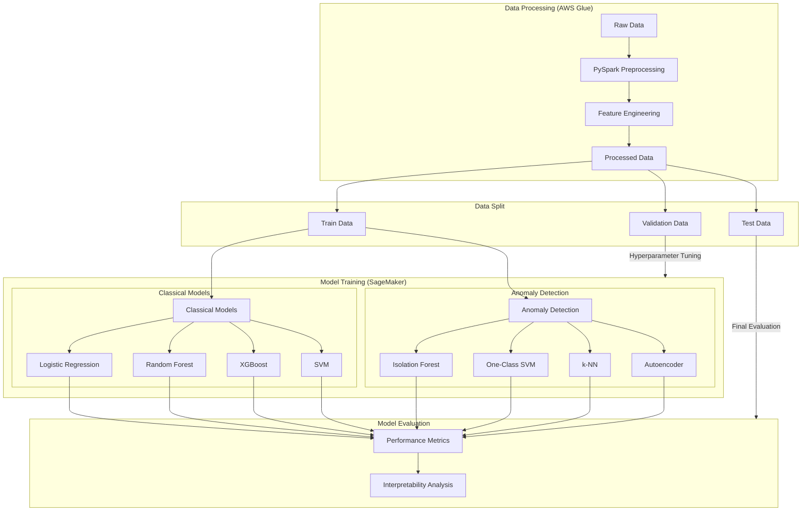

# Comparative Analysis of Classical and Anomaly Detection Methods for Imbalanced Mixed-Data Classification

This project proposal outlines a systematic comparison of classical machine learning algorithms and anomaly detection approaches for handling highly imbalanced mixed-data classification problems in e-commerce. The proposed experimental pipeline, built on AWS SageMaker, will evaluate eight distinct models, including regularized logistic regression, ensemble methods, and deep learning approaches on Amazon product listings (source: Asaniczka (September, 2023) Amazon Products Dataset 2023). The methodology implements k-fold cross-validation for robust hyperparameter optimization, with comprehensive statistical testing planned to assess model performance differences. Initial data preprocessing and feature engineering of product text and numerical attributes is implemented using PySpark through AWS Glue Interactive Sessions. Results and empirical evidence for model selection trade-offs in imbalanced data scenarios will be documented as the experiment progresses, considering both performance metrics and computational requirements.

**Note: This document serves as a proposal and is subject to change. Additional details will be incorporated as the project advances.**

## Objectives 
The challenge of imbalanced data classification has been extensively studied in machine learning literature, both empirically and theoretically (Japkowicz & Stephen, 2002; Krawczyk, 2016; Liu et al., 2019; Sun et al., 2009). Research has established three primary approaches for handling class imbalance: data-level modifications, algorithm-level adaptations, and specialized evaluation metrics. While these approaches have shown promise, the optimal strategy often depends on specific data characteristics and application contexts.

Recent studies have explored the adaptation of classical and deep learning-based classification methods for anomaly detection tasks (Bergman & Hoshen, 2020; Steinwart et al., 2005), as well as the inverse - applying anomaly detection methods to classification problems (Gerych et al., 2019; Kong et al., 2020). However, given the fundamental differences in their underlying assumptions and optimization objectives (He, 2020), the effectiveness of this cross-application requires systematic evaluation.

The key research questions this project aims to address empirically are:

1. How do anomaly detection models compare to classical ML approaches in identifying bestselling products, given the inherent rarity of bestseller status and the mixed nature of product data (text descriptions, pricing, and other attributes)?
2. What is the comparative performance of traditional classifiers versus anomaly detection methods in:
- Precision of bestseller identification (reducing false positives)
- Recall of bestseller detection (minimizing missed opportunities)
- Computational efficiency

## Dataset Description

This project uses the Amazon Best Sellers dataset (Asaniczka, 2023) sourced from Kaggle, comprising 1,426,337 product listings across multiple categories. The dataset exhibits a significant natural class imbalance, with bestseller products representing <1% of total listings. 

This imbalanced distribution, combined with the heterogeneous feature space (text descriptions, numerical attributes, and categorical variables), provides an ideal environment for comparing classical classification and anomaly detection approaches. The large-scale nature of the dataset ensures statistical robustness in model evaluation, while its mixed data types reflect real-world e-commerce data complexity.

### Data Characteristics

- Sample Size: 1,426,337 observations
- Features: 6 variables spanning multiple data types
- Class Distribution: <1% bestsellers vs 99.40% non-bestsellers

### Feature Description

1. Product Identifiers
   - asin: Unique Amazon product identifier (`string`)
   - productURL: Reference URL (`string`, unused in current analysis)
   - imgUrl: Product image URL (`string`, unused in current analysis)

2. Text Features
   - title: Product title (unstructured `text`)

3. Numerical Features
   - price: Current price in USD (`float`)
   - listPrice: Original price in USD (`float`)
   - reviews: Review count (`integer`)
   - stars: Average rating (`float`)

4. Categorical Features
   - category_id: Product category identifier (`integer`)

5. Target Variable
   - isBestSeller: Binary indicator (`boolean`)

### Dataset Selection Rationale

1. **Mixed Data Types**: Combines text, numerical, and categorical features, enabling comprehensive model comparison
2. **Natural Imbalance**: Reflects real-world e-commerce class distribution
3. **Scale**: Sufficient size for robust model evaluation
4. **Multimodal Potential**: Image URLs enable future extension to multimodal analysis

Detailed data processing steps, descriptive statistics, and exploratory data analysis will be presented in subsequent sections. 

## Anticipated Pitfalls and Proposed Solutions

Applying anomaly detection models to classification problems, even imbalanced classification problems, is not a novel approach. While several studies have demonstrated the potential of using anomaly detection for imbalanced classification tasks, the effectiveness of this approach depends heavily on data characteristics and problem context. Before detailing the experimental setup, it is important to understand the potential pitfalls and challenges in applying these methods to e-commerce bestseller classification, particularly with mixed data types.

#### 1. Fundamental paradigm mistamtch
The primary pitfall in applying anomaly detection to bestseller classification stems from the fundamental difference in assumptions. While classification approaches aim to learn decision boundaries between defined classes, anomaly detection is inherently asymmetric, focusing on characterizing a single "normal" class and identifying deviations from it. Speifically, in context of our dataset:
- Non-bestsellers don't constitute a homogeneous "normal" class
- Areas where bestsellers and non-bestsellers share similar features may be mishandled
- Unusual non-bestsellers might be falsely flagged as bestsellers merely for being atypical

Recent studies have proposed sophisticated solutions like outlier scores (Kong et al., 2020) and generative models (Buitrago et al., 2018) to bridge this paradigm gap. However, systematic empirical evidence comparing basic implementations of both approaches remains limited. This project focuses on:
- *Direct Comparison*: Evaluating standard implementations of both paradigms, specifically selecting anomaly detection models (Isolation Forests, k-NN, One-Class SVM, Autoencoders) whose underlying assumptions *broadly* align with heterogeneous e-commerce data characteristics (some customizations might still be needed), rather than methods requiring strict distributional assumptions like Gaussian Mixture Models
- *Consistent Evaluation*: Using the same metrics and validation strategy across all models
- *Practical Viability*: Assessing computational requirements and implementation complexity

#### 2. Data leakage and integrity
The mixed-data nature of e-commerce products presents significant risks of data leakage during preprocessing, particularly when combining high-dimensional text vectors, categorical encodings (270 categories), and numerical features. The transformation pipeline - including text vectorization, categorical encoding, and dimensionality reduction - could introduce information from test data into the training process if not properly handled. Key considerations include:
1. Text vectorization learning vocabulary from entire dataset
2. Categorical encoding schemes capturing full data distribution
3. Dimensionality reduction influenced by global data patterns
4. Cross-validation splits not preserving data independence

The following solutions will be implemented to address some of these concerns:
1. Strict Data Segregation
- Initial train-test-validation split before any preprocessing
- Test set isolated as truly unseen evaluation data
- Validation set reserved for hyperparameter tuning

**Note**: The sequence of text vectorization and train-test-validation splitting remains a debated topic in machine learning practice. As some argue for vectorization before splitting to ensure consistent vocabulary, this project adopts the recommended approach of fitting vectorization only on training data to prevent data leakage. This approach, where all transformations (including vectorization and dimensionality reduction) are fitted on training data and applied to validation/test sets, aligns with the principle of maintaining strict separation between training and evaluation data. 

2. Sequential Preprocessing
- Text vectorization fitted only on training data
- Categorical encoding learned from training set
- Dimensionality reduction parameters estimated on training features
- All transformations applied independently to validation/test sets

3. Robust Validation Framework
- K-fold cross-validation for hyperparameter tuning
- Stratified sampling to maintain class distribution
- Large sample size (n=1.4M) ensuring sufficient data for estimation
- Consistent random seeds for reproducibility

#### 3. Mixed-Data complexities in Anomaly Detection

The curse of dimensionality from text vectors can make normal points appear as outliers, while different scales and distributions across feature types can distort anomaly detection. Furthermore, algorithm-specific issues arise: Isolation Forests may over-split on text features, k-NN distances become unreliable in mixed spaces, and One-Class SVM kernel selection becomes complex. Model-specific issues are discussed in detail during implementation. A critical additional challenge is feature overlap between bestseller and non-bestseller products in this mixed space - a bestselling product might share many text descriptions, similar price points, and category characteristics with non-bestsellers, making it difficult for anomaly detection algorithms to identify meaningful deviations.

**Key Risks:**
- Text vectors dominating anomaly detection due to high dimensionality
- Loss of important numerical signals (like price) in combined feature space
- Unreliable distance metrics in mixed high-dimensional space
- Feature overlap between classes making "anomalous" patterns unclear
- Normal bestseller characteristics might be indistinguishable from non-bestsellers in many dimensions.

To address these challenges, firstly,  feature processing begins with type-specific transformations: TF-IDF vectorization for text, standard scaling for numerical features, and one-hot encoding for categorical variables, with careful attention to normalization to balance feature contributions. Seoncdly, dimensionality reduction will be done using PCA for numerical/encoded features while preserving max. variance, and appropriate methods for text embeddings to manage the high-dimensionality. Model-specific parameters will be tuned to handle the mixed feature space, e.g., Isolation Forest's max_features parameter to prevent text feature dominance, k-NN's composite distance metrics etc. Validation will include monitoring anomaly scores across feature subsets and information loss during dimensionality reduction to ensure detected patterns align with domain knowledge and maintain business relevance.

**Note**: The choice of method using for text-to-vector embeddings will be discussed later.

#### 4. Big Data Processing
Processing a large-scale e-commerce dataset (n=1.4M) with mixed data types presents significant computational challenges. Traditional in-memory processing becomes unfeasible with high-dimensional text vectors and multiple preprocessing steps. Additionally, the iterative nature of model tuning and validation requires efficient data handling strategies, particularly when running multiple models for comparison.

The project will implement a two-phase computational approach. Initial data preprocessing and feature engineering is handled through PySpark in AWS Glue Interactive Sessions, enabling distributed processing of the large dataset. The processed data will then be passed to SageMaker for text vectorization, model training, and validation, leveraging its optimized infrastructure for ML workflows. This separation allows efficient large-scale data processing while maintaining robust model training and validation capabilities within SageMaker's controlled environment.

#### 5. Model Interpretability and Business Value
Perhaps one of the most important questions for this analysis is to answer: why is a product a bestseller? Anomaly detection models, particularly when applied to mixed data, often operate as "black boxes" with scores that are difficult to interpret in business terms. For practical application, stakeholders need clear insights into model decisions.

This project implements three key approaches to enhance model interpretability:

1. **Prediction Uncertainty Quantification**:
Both modeling paradigms will require different approaches for uncertainty estimation. Classical models will utilize probabilistic outputs and bootstrap sampling, while for anomaly detection models, we will explore ensemble-based uncertainty estimates through bootstrap aggregation of anomaly scores to establish confidence bounds in predictions.

2. **Local Feature Attribution**:
SHAP (SHapley Additive exPlanations) values will be implemented to understand individual predictions, providing insights into which features contribute most to bestseller classification. This will allow comparison of feature importance patterns between successful and unsuccessful predictions, offering actionable insights for stakeholders.

3. **Price Sensitivity Analysis**:
Through systematic price variation analysis while controlling other features, we will identify critical price thresholds and category-specific patterns that influence bestseller status. This will provide practical insights into pricing strategies and their impact on bestseller probability.

We may limit interpretation to the best-performing model to save computational resources.

## Experiment Set-Up

Based on the challenges and mitigation strategies discussed, this section outlines the experimental framework that will be used  to compare classical machine learning and anomaly detection models for classifying Amazon bestsellers in a highly imbalanced, mixed-data. The experiments will leverage AWS Glue and SageMaker for scalable data processing and model training.

### I. Overview & Data Pipeline

**Overall Experimental Workflow**
The experiment follows a structured pipeline beginning with distributed data preprocessing using PySpark, followed by model training and evaluation in AWS SageMaker. Feature engineering and data cleaning is conducted using PySpark, while specific model training tasks to be conducted using SageMaker's infrastructure. 

**AWS Infrastructure Setup**
- Data Preprocessing: AWS Glue Interactive Sessions will handle data cleaning, feature engineering, and scaling using PySpark.
- Model Training: SageMaker will train models using dedicated instances based on model complexity:
   - Deep learning models: ml.p3.2xlarge is anticipated to be used for GPU acceleration.
   - Traditional models: ml.m5.4xlarge is anticipated to be used for CPU-based computation.

**Data Processing Steps**

[to be added]

### II. Model Implementation
The implementation strategy accounts for previously discussed challenges, particularly focusing on handling mixed data types and class imbalance while maintaining interpretability. Eight models across two paradigms will be implemented:

**Classical Models**
- Logistic Regression: Baseline model with L1/L2 regularization, class weights adjusted for imbalance.
- Random Forest: Ensemble approach with balanced class weights.
- XGBoost: Gradient boosting implementation with scale_pos_weight parameter for imbalance handling
- SVM: Kernel-based approach with class weights, primarily using RBF kernel for mixed feature space

**Anomaly Detection Models**
- Isolation Forest: Ensemble method particularly suitable for high-dimensional data, contamination parameter set to match class imbalance
- One-Class SVM: Boundary-based detection with RBF kernel, optimized for dataset scale
- k-NN: Distance-based approach with composite distance metrics for mixed features
- Autoencoder: Deep learning approach with architecture designed to handle mixed feature types 

**Note:** There may be modifications to some of the models based on implementation challenges. Any significant changes to the model selection or architecture will be documented during the experiment.

**Hyperparameter Ranges**
Each model's hyperparameters are tuned considering computational constraints and class imbalance:
- Regularization parameters for logistic regression across multiple orders of magnitude.
- Tree depths and ensemble sizes balanced for performance and complexity in Random Forest and XGBoost.
- Learning rates and batch sizes for deep learning models will be optimized.
- Distance metrics and threshold parameters aligned with feature space characteristics for anomaly detection.

**Training Specifications**

1. *Resource Management*: SageMaker instances will be allocated based on model requirements. Deep learning models will utilize ml.p3.2xlarge instances for GPU acceleration, while traditional models will run on ml.m5.4xlarge instances. Parallel training capabilities will be implemented where supported, particularly for Random Forest and XGBoost, to optimize computational efficiency.

2. *Training Controls*: Training will be governed by strict control parameters. Early stopping will trigger if no improvement in validation metrics is observed for 5 consecutive epochs. Maximum training time limits will be enforced for each model type to ensure practical comparison. Batch sizes will be optimized based on memory constraints, while learning rate scheduling will be implemented for deep learning models to ensure stable convergence.

3. *Monitoring and Validation*: SageMaker metrics will be used to establish comprehensive monitoring systems. Real-time performance tracking, cross-validation progress, and computational efficiency will be monitored throughout training. Multiple metrics will be tracked to verify model convergence and ensure reliable comparison across different modeling approaches.

4. *Data Handling*: The training process will maintain stratified sampling throughout to address class imbalance. SageMaker pipe mode will be implemented where applicable for efficient data loading. Consistent feature scaling and proper shuffling mechanisms will be maintained across all data splits to ensure robust model training.

### III. Validation Framework

1. **Cross-validation Setup**
The validation framework will implement a stratified k-fold cross-validation approach (k=5) to ensure consistent class distribution across folds. Given the large dataset size, each fold will maintain sufficient representation of the minority class (bestsellers) for reliable model evaluation. The initial train-test-val split (70-20-10) will be performed before any feature transformation to prevent data leakage.

2. **Hyperparameter Tuning Strategy**
Each model's hyperparameters will be optimized through SageMaker's hyperparameter tuning jobs. Classical models will use randomized search, focusing on improving precision for handling class imbalance. Anomaly detection models will have key parameters, like the contamination rate, tuned to match the data's imbalance and improve performance on metrics like precision-recall

3. **Test Set Evaluation**
The held-out test set will serve as the final evaluation benchmark, and it will remain untouched until all models are optimized. Performance will be evaluated using consistent metrics across both modeling paradigms. 

### IV. Evaluation Strategy

1. **Performance Metrics**
Given the extreme class imbalance (<1% bestsellers), traditional accuracy metrics will be insufficient. The primary evaluation metrics will include Area Under the Precision-Recall Curve (AUPRC), precision at different recall thresholds, and F1 score. For business interpretability, we will also report precision@k (top k predictions) and lift scores. Each metric may be reported with confidence intervals established through bootstrap sampling.

2. **Interpretability Analysis**
Interpretability will be assessed using SHAP values for local feature attribution. Prediction uncertainty will be quantified through bootstrap methods for classical models and ensemble variance for anomaly detection. Price sensitivity analysis will explore the relationship between price and prediction outcomes.

Results will be reported by first week of November.

## Limitations and Future Work

1. This project **does not incorporate time series data**, which may limit the insights gained on how best-selling products vary over time. Seasonal trends and evolving consumer preferences can significantly influence product performance and best-seller status.

2. The project relies solely on one dataset, which may not represent the broader e-commerce landscape. Findings derived from this dataset **may not generalize well to other applications**. Future work should include multiple datasets from various sources to validate the models and ensure their applicability across different contexts.

3. This project also **ignores image features**, which are likely to be key predictors in consumer decisions and preferences in e-commerce settings. Images can provide valuable insights into product attributes and consumer preferences. The next phase can focus on multimodal dataset classification.

4. Optimization, hyperparameter tuning, and interpretation will be **constrained by available computational resources**.

5. While the project emphasizes empirical results, the **use of anomaly detection methods for imbalanced classification is controversial**. As mentioned in the pitfalls section, these approaches represent a fundamental paradigm shift and may not be suitable for production environments without rigorous testing and validation.

6. The dataset had **insufficient features for predicting best sellers**. Future work could benefit from incorporating user behavior data, such as browsing history and click-through rates. This additional information may help refine the models and improve predictions for best-selling products.
