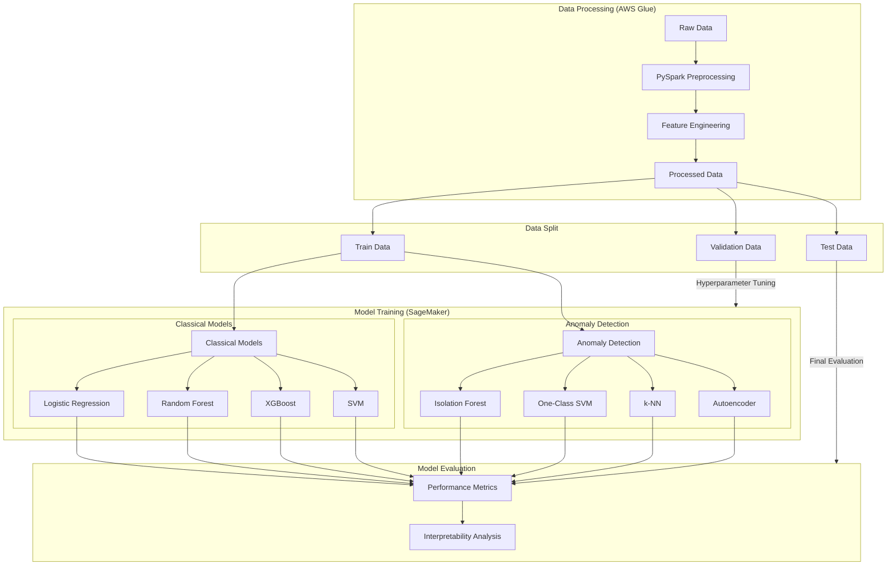

# Comparative Analysis of Classical and Anomaly Detection Methods for Imbalanced Mixed-Data Classification

This project systematically compares classical machine learning and anomaly detection models for handling highly imbalanced mixed-data classification in e-commerce. The experimental pipeline, built on AWS SageMaker, evaluates eight models, including logistic regression, ensemble methods, and deep learning approaches, on Amazon product listings (source: Asaniczka (September, 2023) Amazon Products Dataset 2023).

Key methodologies include Bayesian hyperparameter optimization using SageMaker’s `HyperparameterTuner` for model tuning and statistical testing to assess performance differences. Data preprocessing and feature engineering of text and numerical attributes are handled via PySpark in AWS Glue Interactive Sessions. Results will document model trade-offs in performance and computational efficiency.  

**Note:** This document serves as a proposal and will be updated as the project progresses.  

## Objectives 
The challenge of imbalanced data classification has been extensively studied in machine learning literature, both empirically and theoretically (Japkowicz & Stephen, 2002; Krawczyk, 2016; Liu et al., 2019; Sun et al., 2009). Research has established three primary approaches for handling class imbalance: data-level modifications, algorithm-level adaptations, and specialized evaluation metrics. While these approaches have shown promise, the optimal strategy often depends on specific data characteristics and application contexts.

Recent studies have explored the adaptation of classical and deep learning-based classification methods for anomaly detection tasks (Bergman & Hoshen, 2020; Steinwart et al., 2005), as well as the inverse - applying anomaly detection methods to classification problems (Gerych et al., 2019; Kong et al., 2020). However, given the fundamental differences in their underlying assumptions and optimization objectives (He, 2020), the effectiveness of this cross-application requires systematic evaluation.

The key research questions this project aims to address empirically are:
1. How do anomaly detection models compare to classical ML approaches in identifying bestselling products, given the inherent rarity of bestseller status and the mixed nature of product data (pricing, and other attributes)?
2. What is the comparative performance of traditional classifiers versus anomaly detection methods in:
- Precision of bestseller identification (reducing false positives)
- Recall of bestseller detection (minimizing missed opportunities)
- Computational efficiency (inference latency, resources to train e.g., GPU mem utilization etc.)

## Dataset Description

This project uses the Amazon Best Sellers dataset (Asaniczka, 2023) sourced from Kaggle, comprising 1,426,337 product listings across multiple categories. The dataset exhibits a significant natural class imbalance, with bestseller products representing <1% of total listings. 

### Data Characteristics

- Sample Size: 1,426,337 observations
- Features: 6 variables spanning multiple data types
- Class Distribution: <1% bestsellers vs 99.40% non-bestsellers

### Feature Description

1. Product Identifiers
   - asin: Unique Amazon product identifier (`string`)
   - productURL: Reference URL (`string`, unused in current analysis)
   - imgUrl: Product image URL (`string`, unused in current analysis)

2. Text Features
   - title: Product title (unstructured `text`)
   - Text features were excluded from model comparison due to storage limitations with embedding vectors
   - Initial tests with logit and XGBoost model do show a slight increase in precision when text features are included

3. Numerical Features
   - price: Current price in USD (`float`)
   - listPrice: Original price in USD (`float`)
   - reviews: Review count (`integer`)
   - stars: Average rating (`float`)

4. Categorical Features
   - category_id: Product category identifier (`integer`)

5. Target Variable
   - isBestSeller: Binary indicator (`boolean`)

### Dataset Selection Rationale

1. **Natural Imbalance**: Reflects real-world e-commerce class distribution
2. **Scale**: Sufficient size for robust model evaluation
3. **Multimodal Potential**: Image URLs and text features enable future extension to multimodal analysis

## Experiment Set-Up

Based on the challenges and mitigation strategies discussed, this section outlines the experimental framework that will be used  to compare classical machine learning and anomaly detection models for classifying Amazon bestsellers in a highly imbalanced, mixed-data. The experiments will leverage AWS Glue and SageMaker for scalable data processing and model training.

